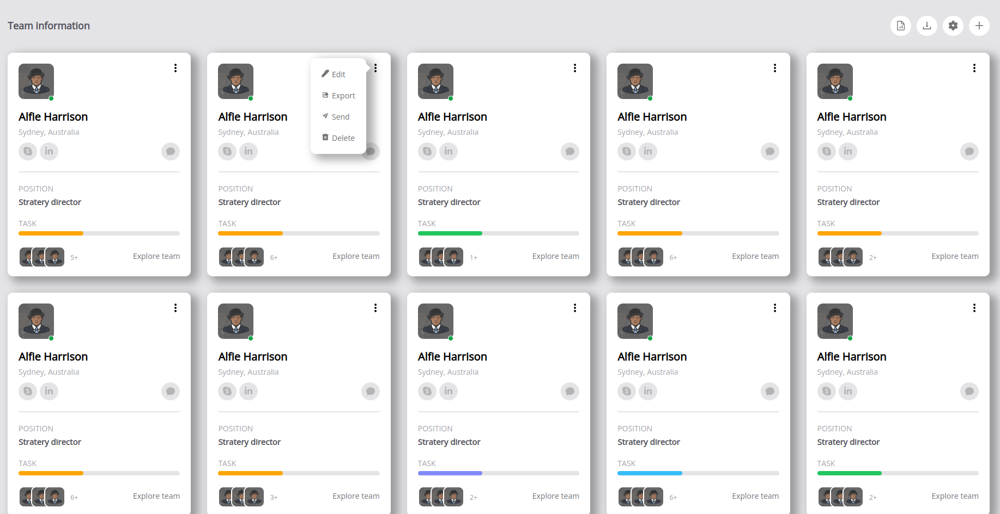
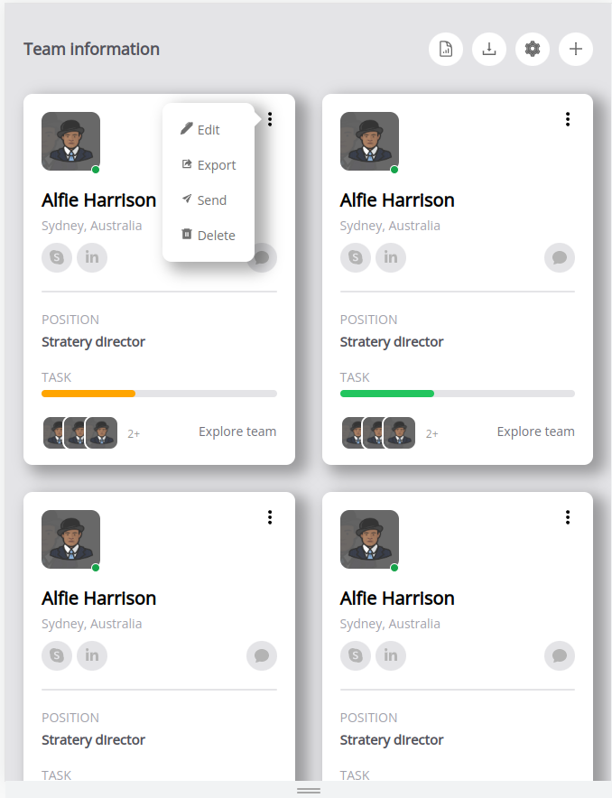

## How to start:
 - Clone this repo
 - Run `npm install` in the first time
 - Run `npm run start` to run this application

## Demo images:  
 - **Desktop view**  

 - **Mobile view**  

## NOTE:  
 - Why do you see two contributors in this repo?
    - Account `DauMoe` is my official account
    - Account `Vinh Nguyen Ngoc` is my account on the company. I tried reset author so all commit's author is `DauMoe` but github still show the contributor :< 